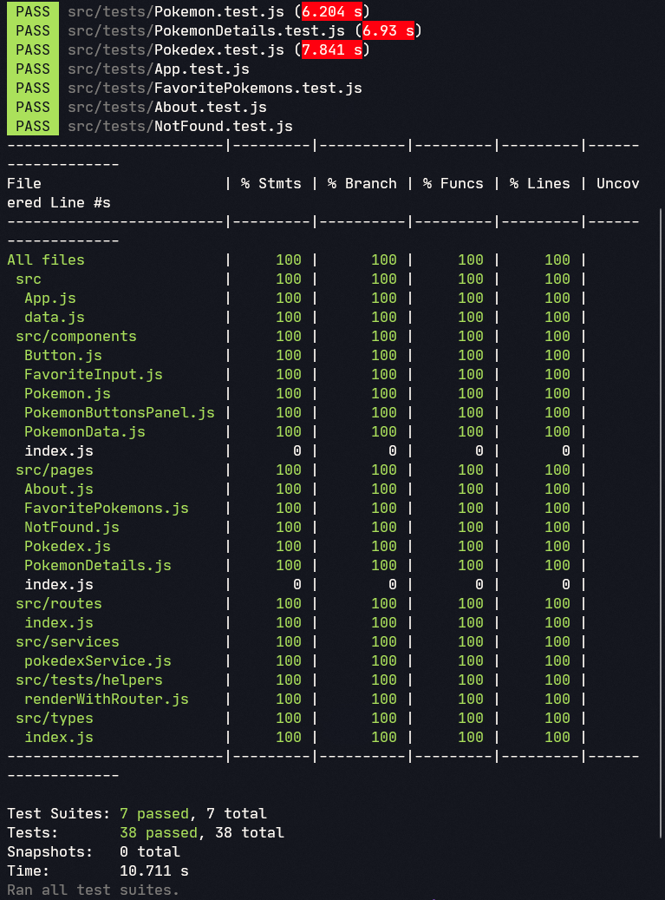

# 👾 Testes com React Testing Library

<br />

## 📡 Desenvolvimento

Projeto desenvolvido na <a href="https://betrybe.com/" target="_blank">Trybe</a> durante o módulo de Front-End!

Nesse projeto praticamos testes com a biblioteca de testes do React, a React Testing Library.

## ⚙️ Tecnologias

* React.js
* React Testing Library (RTL)
* Jest.js
* Stryker Mutator

<br />

## 📚 Documentação

  <details>
    <summary>Instalação e execução</summary>
    <br />

- Faça o fork do repositório:
  Tutorial [AQUI](https://github.com/UNIVALI-LITE/Portugol-Studio/wiki/Fazendo-um-Fork-do-reposit%C3%B3rio)
- Abra seu terminal e navegue até a pasta onde preferir alocar o projeto.

- Clone o repositório:

  ```sh
    git clone git@github.com:"SeuNomeNoGitHub"/tests-with-react-testing-library.git
  ```

- Apos ter o repositório clonado em sua maquina, execute este comando para acessar a parta do projeto:

  ```sh
    cd tests-with-react-testing-library
  ```

- Dentro da pasta do projeto, execute o comando abaixo para instalar as dependências do projeto:

  Caso utilize o npm:

  ```sh
    npm install
  ```

- Dentro da pasta do projeto, execute o comando abaixo para conferir a cobertura de testes:

      Caso utilize o npm:

      ```sh
        npm run test-coverage
      ```

    </details>
  <br />

# 📷 Screenshots



#

<div>
  <p align="center">🍐</p>
</div>
